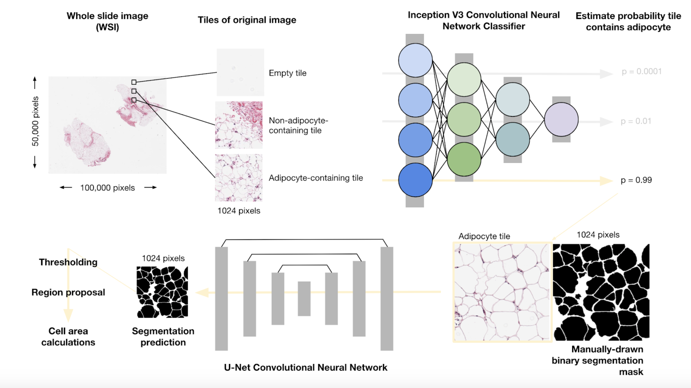

# Adipose Tissue U-Net

Deep learning pipeline for automated adipocyte (fat cell) segmentation from fluorescent histology images using U-Net architecture.



---

## 🎯 Project Goal

Develop an automated pipeline for quantifying adipocyte morphology in meat tissue samples using **SYBR Gold + Eosin fluorescent staining**. The system segments individual fat cells from high-resolution histology images to enable large-scale analysis of meat quality characteristics.

**Key Applications:**
- Automated adipocyte size and density measurements
- Meat quality assessment and grading
- Research into fat distribution patterns
- High-throughput tissue analysis

---

## 📊 Current Status

### ✅ Completed
- **Dataset Pipeline**: Comprehensive preprocessing with optional stain normalization
- **Training Framework**: TF2.13-compatible U-Net with reproducible training
- **Evaluation System**: Multi-checkpoint evaluation with test-time augmentation
- **Test Set Isolation**: Separate test directory ensuring no data leakage
- **Quality Control**: Automated blur detection, white tile filtering, confidence scoring
- **Visualization Tools**: Model comparison plots and performance tracking

### 🔄 In Progress
- Dataset builds with various preprocessing configurations
- Model training and hyperparameter optimization
- Comprehensive evaluation across checkpoints

### 📋 Roadmap
- Enhanced visualization of segmentation results
- Batch inference pipeline for new samples
- Integration with downstream morphology analysis tools

---

## 🏗️ Repository Structure

```
adipose_tissue-unet/
├── build_dataset.py              # Main dataset builder with stain normalization
├── build_test_dataset.py         # Test-specific dataset builder
├── train_adipose_unet_2.py       # TF2 training script
├── full_evaluation.py            # Comprehensive checkpoint evaluation
├── full_evaluation_enhanced.py   # Enhanced evaluation with TTA
├── evaluate_all_checkpoints.py   # Batch checkpoint evaluation
├── visualize_checkpoint_metrics.py # Training progress visualization
├── analyze_test_set_sources.py   # Test set composition analysis
├── run_complete_pipeline.sh      # End-to-end pipeline automation
├── seed.csv                      # Random seed for reproducibility
├── PIPELINE_README.md            # Detailed pipeline documentation
│
├── src/
│   ├── models/
│   │   ├── adipocyte_unet.py     # TF2.13 U-Net implementation
│   │   └── clr_callback.py       # Cyclic learning rate scheduler
│   └── utils/
│       ├── data.py               # Data loading and augmentation
│       ├── runtime.py            # TF2 GPU configuration
│       ├── seed_utils.py         # Reproducible random seed management
│       ├── stain_normalization.py # SYBR Gold + Eosin normalization
│       └── stain_reference_metadata.json
│
├── checkpoints/                  # Model checkpoints (not in git)
├── adipocyte_legacy_files/       # Original implementation (archived)
└── tools/                        # Utility scripts
```

---

## 🚀 Quick Start

### Installation

**Requirements:**
- Ubuntu 22.04 (or similar Linux)
- Python 3.10
- CUDA-capable GPU (recommended)
- TensorFlow 2.13.1

```bash
# Create conda environment
conda create -n adipose-tf2 python=3.10
conda activate adipose-tf2

# Install core dependencies
pip install tensorflow==2.13.1 keras==2.13.1
pip install opencv-python scikit-image tifffile
pip install matplotlib seaborn pandas tqdm

# Verify GPU availability
python -c "import tensorflow as tf; print(tf.config.list_physical_devices('GPU'))"
```

### Dataset Preparation

**1. Build training/validation dataset with stain normalization:**
```bash
python build_dataset.py \
  --stain-normalize \
  --target-mask fat \
  --subtract --subtract-class bubbles \
  --min-mask-ratio 0.05 \
  --stride 1024
```

**2. Build dataset without stain normalization:**
```bash
python build_dataset.py \
  --no-stain-normalize \
  --target-mask fat \
  --subtract --subtract-class bubbles \
  --min-mask-ratio 0.05
```

**Key Parameters:**
- `--stain-normalize`: Apply SYBR Gold + Eosin color correction
- `--subtract`: Remove bubble annotations from fat masks
- `--min-mask-ratio`: Minimum mask coverage (default: 0.05 = 5%)
- `--stride`: Tile stride for overlapping/non-overlapping tiles
- `--white-ratio`, `--blur-th`: Quality filtering thresholds

Output: `~/Data_for_ML/Meat_Luci_Tulane/_build_YYYYMMDD_HHMMSS/`

### Training

```bash
python train_adipose_unet_2.py \
  --build-dir ~/Data_for_ML/Meat_Luci_Tulane/_build_20251104_152203 \
  --epochs 100 \
  --batch-size 8
```

**Features:**
- Automatic mixed-precision training
- Cyclic learning rate scheduling
- Data augmentation (rotation, flip, intensity)
- Checkpointing with early stopping
- TensorBoard logging

### Evaluation

**Single checkpoint evaluation:**
```bash
python full_evaluation.py \
  --checkpoint checkpoints/checkpoint_20251104_120000/weights.h5 \
  --test-dir ~/Data_for_ML/Meat_Luci_Tulane/_build_20251104_152203/dataset/test
```

**Batch evaluation across all checkpoints:**
```bash
python evaluate_all_checkpoints.py \
  --checkpoints-dir checkpoints/ \
  --test-dir ~/Data_for_ML/Meat_Luci_Tulane/_build_20251104_152203/dataset/test
```

---

## 🔬 Key Features

### 1. **Stain Normalization**
- SYBR Gold + Eosin color correction using Reinhard method
- Consistent preprocessing across batches
- Optional - can be disabled for raw data training

### 2. **Quality Filtering**
- Blur detection via Laplacian variance
- White tile removal (empty regions)
- Confidence score filtering for annotations

### 3. **Data Integrity**
- Test set completely isolated in separate directory
- No data leakage between train/val/test
- Identical preprocessing for all splits
- Reproducible builds with seed management

### 4. **Bubble Subtraction**
- Removes bubble annotations from fat masks
- Ensures clean training targets
- Morphological cleanup options

### 5. **Comprehensive Evaluation**
- Test-time augmentation (TTA) support
- Multi-metric evaluation (Dice, IoU, Precision, Recall)
- Visualization of predictions
- Checkpoint comparison plots

---

## 📈 Dataset Statistics

Typical build produces:
- **Training**: ~60% of tiles from main directory
- **Validation**: ~20% of tiles from main directory  
- **Test**: ~7 separate slide images from test subdirectory
- **Tile size**: 1024×1024 pixels
- **Format**: JPEG (images), TIFF (masks)

---

## 🔧 Configuration Files

### seed.csv
```csv
seed
865
```
Central random seed for all operations ensuring reproducibility.

### stain_reference_metadata.json
Metadata for stain normalization reference images including color statistics for SYBR Gold + Eosin normalization.

---

## 📚 References

**Original Implementation:**
- Glastonbury et al., "Automatic Adipocyte Detection and Quantification in Histology Images Using Deep Learning"
- GitHub: [GlastonburyC/Adipocyte-U-net](https://github.com/GlastonburyC/Adipocyte-U-net)

**Architecture:**
- Ronneberger et al., "U-Net: Convolutional Networks for Biomedical Image Segmentation" (2015)

**Stain Normalization:**
- Reinhard et al., "Color Transfer between Images" (2001)

---

## 📝 License

See [LICENSE](LICENSE) file for details.

---

## 🤝 Contributing

This is an active research project. For questions or collaboration inquiries, please open an issue.

---

## 📧 Contact

Repository maintained by InstaFlo.

**Binder Demo:** [](https://mybinder.org/v2/gh/InstaFlo/adipose_tissue-unet/main)
